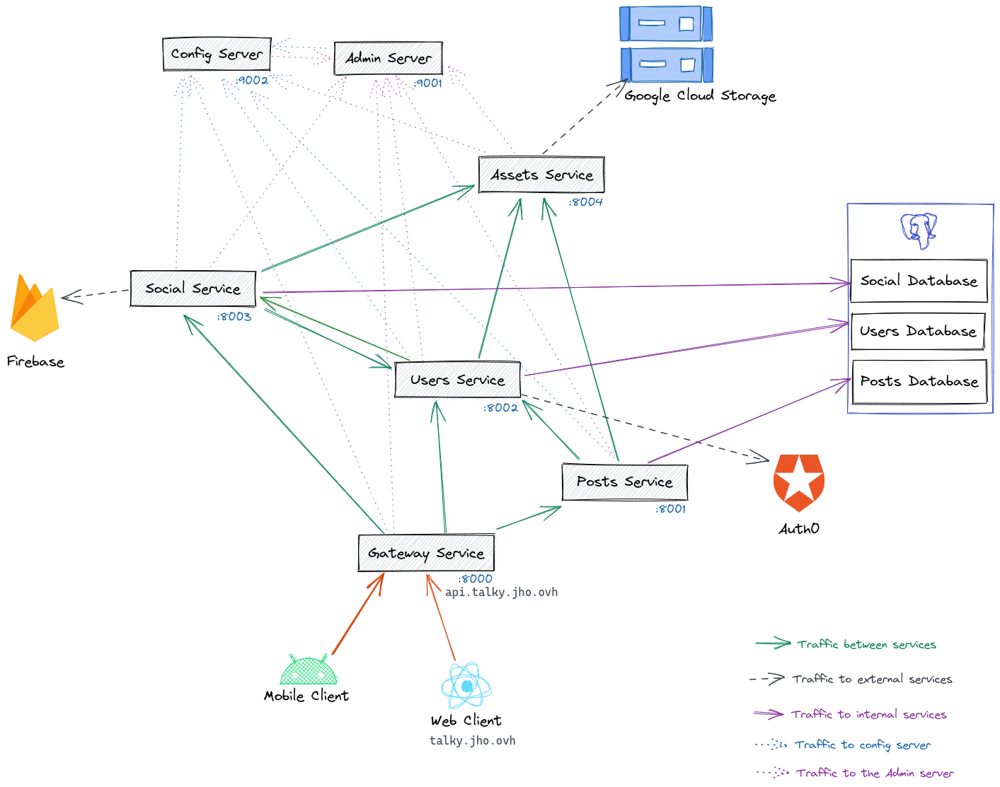

# Réseau Social

## Authors


## Project specs

### User Management
- create user
- update profile
- get profile

### Assets management
- images stores in buckets with signed links to access it

### Posts
- create post
- comment post
- like post

### Friends
- create friend request
- accept friend request
- decline friend request
- real time messaging (Firebase push notifications)

## Architecture



## Backend structure
```
.
├── admin-server
│         └── pom.xml            # spring boot admin server 
├── commons
│         └── pom.xml            # Common library with shared classes among Spring boot services
├── config-server
│         └── pom.xml            # spring cloud config server
├── parents
│         ├── pom.xml            # Module that contains all parents pom
│         ├── spring-core
│         │         └── pom.xml  # Parent pom for all spring boot based modules
│         └── spring-service
│             └── pom.xml        # Parent pom for all spring boot services
├── pom.xml                      # Root module
└── user-service
    └── pom.xml                  # Service that manage users
```
